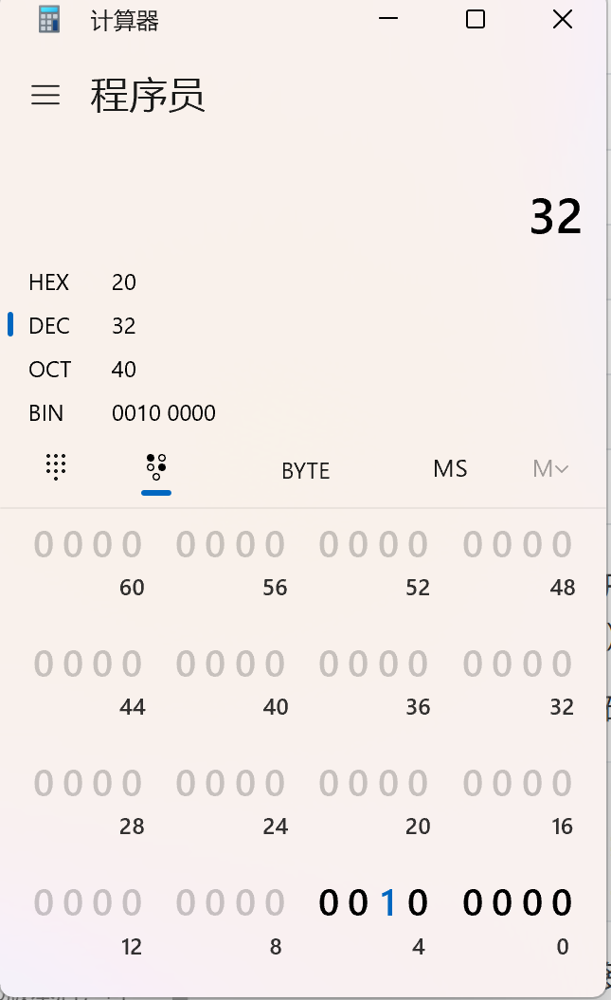
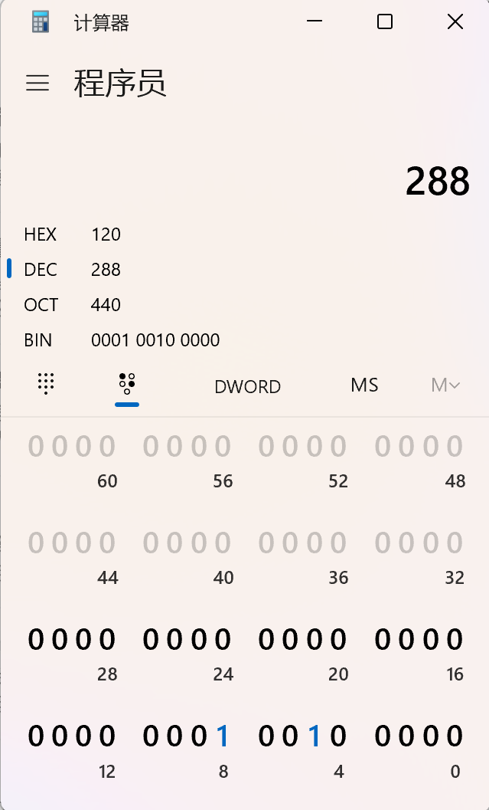
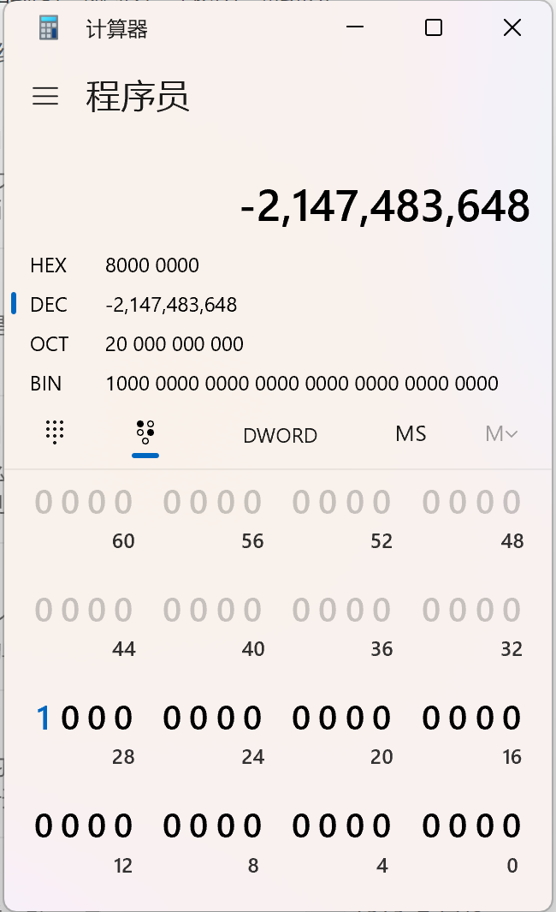
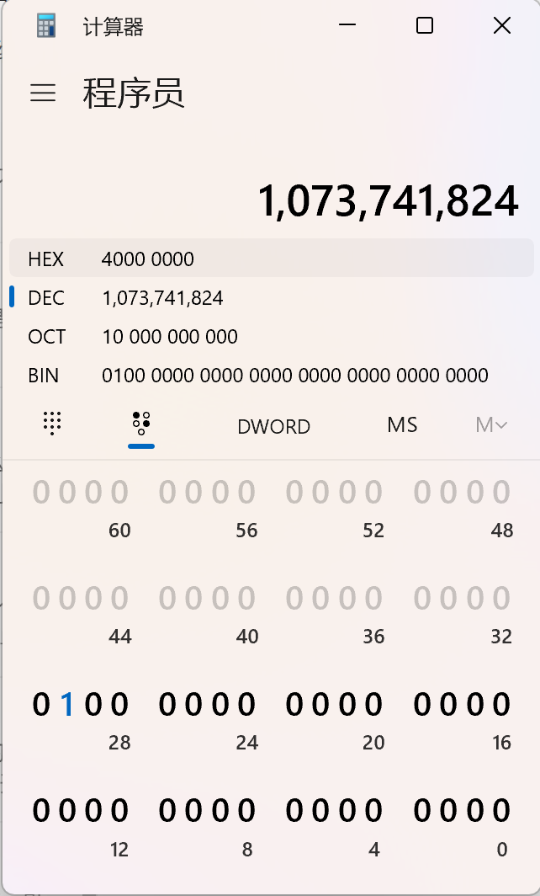
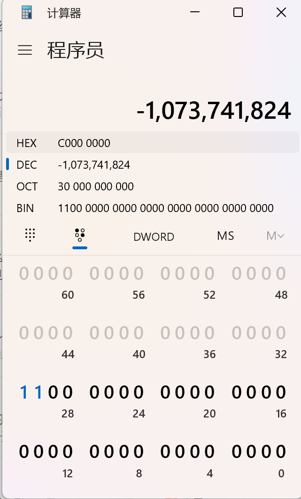

# 运算符

在Java中运算符有以下集中类别：

1. 赋值运算符
2. 算术运算符
3. 一元运算符
4. 关系运算符
5. 条件运算符
6. 类型比较运算符
7. 位运算符


---


## 赋值运算符

| 符号 | 描述       |
| ---- | ---------- |
| `=`  | 赋值运算符 |

`=` 该符号在所有编程语言中表示赋值的意思，将右边所代表的值赋给左边变量（表现上看），但每种语言底层又各不相同，有的赋值是赋值地址，有的赋值是赋值副本，知道即可，具体细节看官方文档即可。

在 Java 中：

- 基本数据类型（如 int、double）进行赋值时传递的是值。
- 对象赋值时传递的是引用，但 String 类型比较特殊，它类似于值类型，赋值时会生成新的对象。

下面我们举例说明：

**值传递**

```java
// 这里就是传的a的副本，并没有将a的地址传给b
int a = 10;
int b = a;  // 此时是把a的值复制给b
b = 20;  // 对b进行修改，并不会影响到a
System.out.println(a);  // 输出结果为10
```

**地址传递**

```java
// 这里传的就是地址，将list_a的地址赋给了list_b，所以我们在修改list_b的时候，也就相当于修改了list_a
int[] list_a = {1, 2, 3};
int[] list_b = list_a;  // 传递引用，指向同一数组

list_b[0] = 100;  // 修改元素，list_a会同步变化
System.out.println(Arrays.toString(list_a));  // 输出 [100, 2, 3]
```

综上，这里涉及语言底层的运行原理，两大知识点，一个是**值传递**，一个是**地址传递**，详细内容会在后面做补充。


---


## 算术运算符

| 符号 | 描述                             |
| ---- | -------------------------------- |
| `+`  | 加法运算符（也用于 String 串联） |
| `-`  | 减法运算符                       |
| `*`  | 乘法运算符                       |
| `/`  | 除法运算符                       |
| `%`  | 余数运算符                       |

 这里和数学运算逻辑一样，不再讲述。


---


## 一元运算符

| 符号 | 描述                                                  |
| ---- | ----------------------------------------------------- |
| `+`  | 一元加号运算符;表示正值（但是，没有此值的数字为正值） |
| `-`  | 一元减号运算符;否定表达式                             |
| `++` | Increment 运算符;将值增加 1                           |
| `--` | 递减运算符;将值递减 1                                 |
| `!`  | 逻辑补码运算符;反转布尔值                             |

`++` ，Increment（自增） 运算符，将值增加 1。

下面举例说明：

```java
int i = 1;
// i++; // 自增1
System.out.println(i++); // 结果：1

// 除了上面写法，我们还可以这样写
int j = 3;
// ++j; // 自增1
System.out.println(++j); // 结果：4

/* 
二者区别：
同样都是自增，但是我们会发现，一个自增符号在前，一个自增符号在后，对就是你所理解的意思，一个自增先发生，一个自增后发生。
i++：自增后发生，这里相当于先给i赋值为1（这里不要理解偏了，int i = 1->这叫做初始化，和i++先给i赋值是两码事），再去做运算，所以最后结果输出为1。
++j：自增先发生，这里就相当于先给j做自增运算，再重新给j赋值，所以最后结果为4。
*/
```

`--` 和 `++` 一样，只不过是自减。

`!` 逻辑补码运算符;反转布尔值，平常称作逻辑非运算，前面学习过boolean类型，便知道在计算机中`0`代表false（假），`1`代表true（真）。

```java
String str = "abcd";
//		System.out.println(!str); // 报错
//      System.out.println(!0); // 报错
boolean bool = true;
System.out.println(!bool); // 结果：false
```

在 Java 中，`!`运算符只能用于布尔类型（`boolean`或者`Boolean`），若将其用于其他类型，编译时就会报错。这一点和 C/C++ 不同，在 C/C++ 里，非零值会被当作`true`（Python亦是如此），而 Java 不存在这种隐式转换。

**综上，`!` 在Java中只能应用与boolean和Boolean类型。**


---


## 关系运算符（返回值为布尔类型）

| 符号 | 描述       |
| ---- | ---------- |
| `==` | 等于       |
| `!=` | 不等于     |
| `>`  | 大于       |
| `>=` | 大于或等于 |
| `<`  | 小于       |
| `<=` | 小于或等于 |

 这里知道返回值为布尔类型，成立为true，不成立为false。即可。


---


## 条件运算符

| 符号 | 描述       |
| ---- | ---------- |
| `&&` | 条件 AND   |
| `||` | 条件 - OR  |
| `?:` | 三目运算符 |

 `&&` 条件 AND，又称作短路与。

下面举例说明：

```java
// 这里用到if条件语句，初学者可能不知道，不要紧先看
boolean bool1 = true;
boolean bool2 = true;
boolean bool3 = false;
boolean bool4 = true;
// 在()中作判断，bool1 && bool2只有当二者都为true，if的方法体才会被执行。
if(bool1 && bool2) {
    // 方法体
}

// 这里注意，使用短路与，如果第一个参数bool3为false，那么if会直接结束判断，后面的bool4不再进行判断
if(bool3 && bool4) {
    // 方法体
}
```

`||` 条件 - OR，又称短路或，和短路与一样，但俩参数有一个为true，则整体为true。

`?:` 三目运算符，下面举例说明：

```java
int age = 17;
// 三目运算符的格式为：条件表达式 ? 值1 : 值2
// 当条件表达式为true，返回值1
// 当条件表达式为false，返回值2
String result = age >= 18 ? "已成年" : "未成年";
System.out.println("这个人" + result); // 输出：这个人未成年
```


## 类型比较运算符

| 符号         | 描述                     |
| ------------ | ------------------------ |
| `instanceof` | 将对象与指定类型进行比较 |

 `instanceof`，你可以判断一个对象是否属于某个特定类。

简单来说就是，在我们开发时我们会将很多类定义为接口、抽象类或者某个子类继承父类，然后再去具体实现接口、继承抽象类或者父类，当我们需要判断某个类是否继承了或实现了其他类，可以使用`instanceof`来判断。

在进行向下转型（将父类引用转换为子类类型）之前，通常会使用`instanceof`来确保转换的安全性，避免出现`ClassCastException`。


## 位运算符

| 符号  | 描述                                     |
| ----- | ---------------------------------------- |
| `~`   | 一元按位补码（按位非）                   |
| `<<`  | 有符号左移（何为有符号，看下面例子可知） |
| `>>`  | 有符号右移                               |
| `>>>` | 无符号右移                               |
| `&`   | 按位 AND                                 |
| `^`   | 按位异或                                 |
| `|`   | 按位（含 OR）                            |

位运算符要求开发者对二进制有一定的了解，下面会以十进制 9 ，二进制一个 8 位为例子讲述（9 的二进制 0000 1001，后面会简写成：9 : 0000 1001）。

`~` 一元按位补码，又称按位非。

```java
int i = 9; // 9 : 0000 1001
int a = ~i; // 对 9 : 0000 1001 进行补码。二进制先取反 1111 0110 ，在加 +1 得 1111 0111
System.out.println(a) // -9 : 1111 0111
```

`<<` 有符号左移。

```java
int i = 9; // 9 : 0000 1001
int a = i << 5; // 对 9 : 0000 1001 进行有符号左移 5 位。二进制先所有数字左移 5 位（溢出的扔掉，原本的位置经过左移，空出的用 0 填充）得 0010 0000
System.out.println(a) // 逻辑上来说结果应该是 32 ，但是开发者不要忘记一件事 int 类型是 32 位的，这就是说左移后 9 的是没有超出 int 类型长度的，所以这里会输出 288
```





`>>` 有符号右移

```java
// 这里不再使用 9 更直观一些
int i = -2_147_483_648;
int a = i >> 1; // 这里右移一位应该是 1,073,741,824，但是 << 的计算规则要保留符号，所以最高位要调整为 1
System.out.println(a);
```







`>>>` 无符号右移

```java
// 这里不再使用 9 更直观一些
int i = -2_147_483_648;
int a = i >>> 1; // 这里右移一位应该是 1,073,741,824
System.out.println(a);
```

在大部分语言中是没有 `<<<` 的运算的（高位经过左移后会直接舍弃），但是存在运算逻辑，直接*2^n^ 即可但是要保证不要超出对应类型长度。

`&` 按位与

```
9 : 0000 1001
15:	0000 1111
9 : 0000 1001

9 & 15 = 9
0000 1001 & 0000 1111 = 0000 1001
```

```java
int i = 9;
int a = i & 15;
// 二进制同位为 1 则取 1，否则取 0
System.out.println(a); // 9
```

`^` 按位异或

```
9 : 0000 1001
15:	0000 1111
6 : 0000 0110

9 ^ 15 = 6
0000 1001 ^ 0000 1111 = 0000 1001
```

```java
int i = 9;
int a = i & 15;
// 二进制同位不同为 1 且二者都不为 0 取 1，否则取 0
System.out.println(a); // 6
```

`|` 按位

```
9 : 0000 1001
15:	0000 1111
6 : 0000 0110

9 ^ 15 = 6
0000 1001 ^ 0000 1111 = 0000 1001
```

```
int i = 9;
int a = i & 15;
// 二进制同位不同为 1 且二者都不为 0 取 1，否则取 0
System.out.println(a); // 6
```

