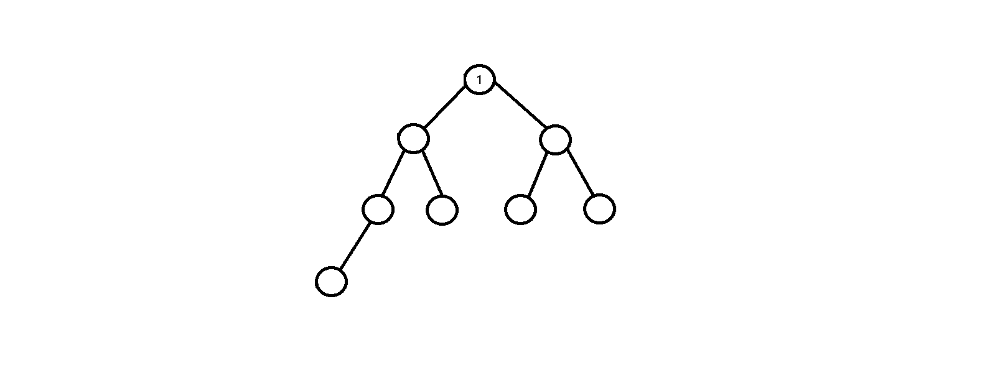
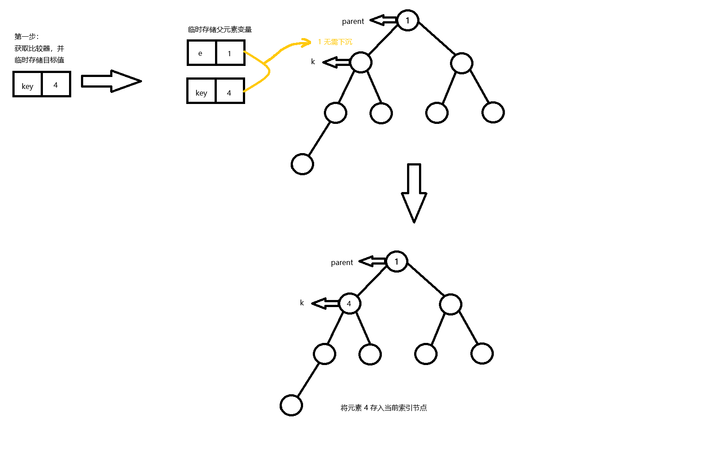
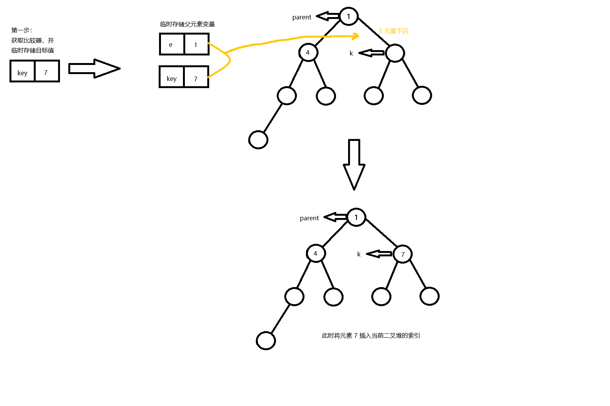
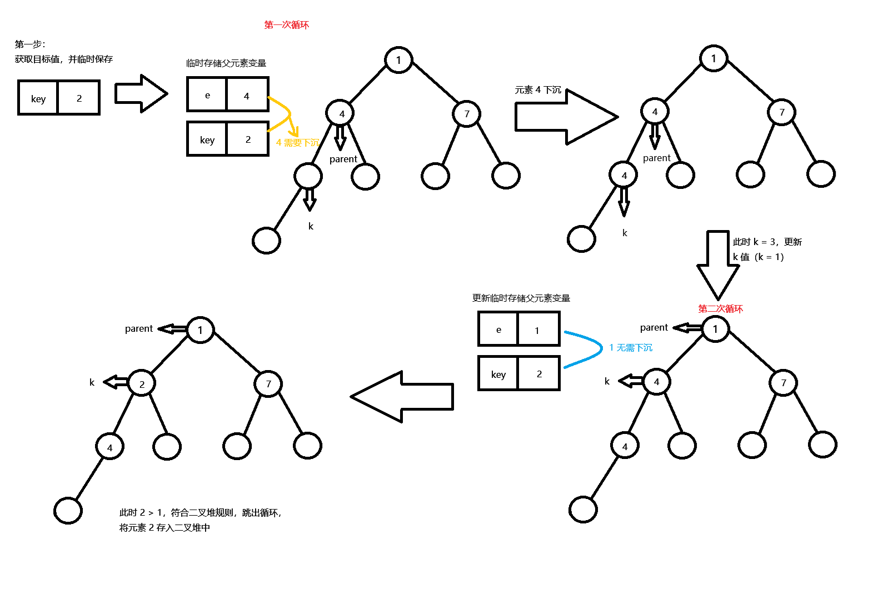

# PriorityQueue

`PriorityQueque` 优先队列，无界。

虽然 `PriorityQueue` 被称为队列，但是从逻辑角度来说 `PriorityQueue` 不再是队列（不遵守 FIFO 原则），但是其操作特性比如：操作首尾（实际上是操作优先级别最高或最低的元素）。

这里开发者可以保持疑问，在后面的源码中会得到答案。

## 源码

```java
public class PriorityQueue<E> extends AbstractQueue<E>
    implements java.io.Serializable {

    @java.io.Serial
        private static final long serialVersionUID = -7720805057305804111L;

    // PrioityQueue 默认的初始化容量
    private static final int DEFAULT_INITIAL_CAPACITY = 11;

    // 底层实现数组，但是 PriorityQueue 的本质为二叉堆
    transient Object[] queue;

    // PriorityQueue 长度
    int size;

    // 比较器
    @SuppressWarnings("serial")
    private final Comparator<? super E> comparator;

    // 修改次数，当有多个线程修改一个 PriorityQueue ，modCount 会记录修改次数，如果匹配不上则其会出发快速失败机制
    transient int modCount;

    // 无参构造
    public PriorityQueue() {
        this(DEFAULT_INITIAL_CAPACITY, null);
    }

    /**
    * 指定初始化容量值
    * param:
    * 		initialCapacity: 初始化容量值
    */
    public PriorityQueue(int initialCapacity) {
        this(initialCapacity, null);
    }

    /**
    * 指定初始化比较器
    * param:
    * 		comparator: 自定义比较器
    */ 
    public PriorityQueue(Comparator<? super E> comparator) {
        this(DEFAULT_INITIAL_CAPACITY, comparator);
    }

    /**
    * 指定初始化容量值比较器
    * param:
    * 		initialCapacity: 初始化容量值
    * 		comparator: 自定义比较器
    */ 
    public PriorityQueue(int initialCapacity,
                         Comparator<? super E> comparator) {

        if (initialCapacity < 1)
            throw new IllegalArgumentException();
        this.queue = new Object[initialCapacity];
        this.comparator = comparator;
    }

    /**
    * 初始化时其中包含的元素为参数 c 中所包含的元素
    * param:
    * 		c: 指定集合
    */ 
    public PriorityQueue(Collection<? extends E> c) {
        if (c instanceof SortedSet<?>) {
            SortedSet<? extends E> ss = (SortedSet<? extends E>) c;
            this.comparator = (Comparator<? super E>) ss.comparator();
            initElementsFromCollection(ss);
        }
        else if (c instanceof PriorityQueue<?>) {
            PriorityQueue<? extends E> pq = (PriorityQueue<? extends E>) c;
            this.comparator = (Comparator<? super E>) pq.comparator();
            initFromPriorityQueue(pq);
        }
        else {
            this.comparator = null;
            initFromCollection(c);
        }
    }

    /**
    * 初始化时其中包含的元素为参数 c 中所包含的元素
    * param:
    * 		c: 指定的优先队列
    */ 
    public PriorityQueue(PriorityQueue<? extends E> c) {
        this.comparator = (Comparator<? super E>) c.comparator();
        initFromPriorityQueue(c);
    }

    /**
    * 初始化时其中包含的元素为参数 c 中所包含的元素
    * param:
    * 		c: 指定的 SoertSet 集合
    */ 
    public PriorityQueue(SortedSet<? extends E> c) {
        this.comparator = (Comparator<? super E>) c.comparator();
        initElementsFromCollection(c);
    }

    private void initFromPriorityQueue(PriorityQueue<? extends E> c) {
        if (c.getClass() == PriorityQueue.class) {
            this.queue = ensureNonEmpty(c.toArray());
            this.size = c.size();
        } else {
            initFromCollection(c);
        }
    }

    private void initElementsFromCollection(Collection<? extends E> c) {
        Object[] es = c.toArray();
        int len = es.length;
        if (c.getClass() != ArrayList.class)
            es = Arrays.copyOf(es, len, Object[].class);
        if (len == 1 || this.comparator != null)
            for (Object e : es)
                if (e == null)
                    throw new NullPointerException();
        this.queue = ensureNonEmpty(es);
        this.size = len;
    }

    private void initFromCollection(Collection<? extends E> c) {
        initElementsFromCollection(c);
        heapify();
    }

    /**
    * 扩容方法
    * param:
    *		minCapacity: 最小扩容量
    */
    private void grow(int minCapacity) {
        // 旧容量
        int oldCapacity = queue.length;

        int newCapacity = ArraysSupport.newLength(oldCapacity,
                                                  minCapacity - oldCapacity,
                                                  oldCapacity < 64 ? oldCapacity + 2 : oldCapacity >> 1);
        queue = Arrays.copyOf(queue, newCapacity);
    }

    /**
    * 从这里开始基本就是 PriorityQueue 的核心知识点了。
    * PriorityQueue 的底层是二叉堆，二叉堆的核心操作就是向上堆化和向下堆化。
    * 关于二叉堆的学习，在本节不会提及，开发者如果未学习过，可以自行搜寻资料。
    * 所有的代码讲解均已小顶堆为例。
    * 这里仅对部分概念做讲解
    * 小顶堆：根节点永远小于孩子节点
    * 大顶堆：根节点永远大于孩子节点
    * 向上堆化：插入操作，先将元素插入数组末尾然后向上浮动
    * 向下堆化：删除操作，删除堆顶元素，此时堆顶为空，需要填充，二叉堆中最后的元素填至堆顶，然后向下浮动
    */
    /**
    * 向上堆化
    * 操作逻辑：
    * 找到位置 k => 插入元素 x => 调整元素 x 位置直至符合二叉堆规则
    * 详细操作请看下面代码注释
    * param:
    * 		k: 指定索引
    * 		x: 指定元素
    */
    private void siftUp(int k, E x) {
        // 判断开发者是否自定义了比较器 Comparator
        if (comparator != null)
            siftUpUsingComparator(k, x, queue, comparator);
        else
            siftUpComparable(k, x, queue);
    }

    /**
    * 按照元素自定义比较器进行浮动排序，默认是自然排序
    * 这里开发者需要注意，使用 PriorityQueue 进行存储结构的元素必须实现 Comparable 接口
    * param:
    * 		k: 指定索引
    * 		x: 指定元素
    * 		es: 指定数组
    */
    private static <T> void siftUpComparable(int k, T x, Object[] es) {
        // 获取元素 x 的比较器
        Comparable<? super T> key = (Comparable<? super T>) x;

        // 这里会进入循环，其目的是找到元素 x 的最佳位置
        while (k > 0) {
            // 寻找插入位置的
            int parent = (k - 1) >>> 1;
            // 存储父节点
            Object e = es[parent];
            // 对元素 x 进行判断是否达到最佳最佳位置
            if (key.compareTo((T) e) >= 0)
                // 达到最佳位置跳出循环
                break;
            // 父节点下沉至 k ，为 x 元素腾出位置
            es[k] = e;
            // 重新赋值 k，进行向上浮动操作
            k = parent;
        }
        // 跳出循环，找到最佳位置
        es[k] = key;
    }

    /**
    * 按照元素自定义比较器进行浮动排序，按指定的 Comparator 进行排序
    * param:
    * 		k: 指定索引
    * 		x: 指定元素
    * 		es: 指定数组
    */
    private static <T> void siftUpUsingComparator(
        int k, T x, Object[] es, Comparator<? super T> cmp) {
        // 这里会进入循环，其目的是找到元素 x 的最佳位置
        while (k > 0) {
            // 寻找插入位置的
            int parent = (k - 1) >>> 1;
            // 存储父节点
            Object e = es[parent];
            // 对元素 x 进行判断是否达到最佳最佳位置
            if (cmp.compare(x, (T) e) >= 0)
                // 达到最佳位置跳出循环
                break;
            // 父节点下沉至 k ，为 x 元素腾出位置
            es[k] = e;
            // 重新赋值 k，进行向上浮动操作
            k = parent;
        }
        // 跳出循环，找到最佳位置
        es[k] = x;
    }

    /**
    * 向下堆化
    * 操作逻辑：
    * 找到位置 k => 插入元素 x => 调整元素 x 位置直至符合二叉堆规则
    * 详细操作请看下面代码注释，这里不要跳过，不要跳过，其具体实现起来和 siftUp() 还是有区别的
    * param:
    * 		k: 指定索引
    * 		x: 指定元素
    */
    private void siftDown(int k, E x) {
        if (comparator != null)
            siftDownUsingComparator(k, x, queue, size, comparator);
        else
            siftDownComparable(k, x, queue, size);
    }

    /**
    * 向下堆化
    * param:
    * 		k: 指定索引
    * 		x: 指定元素
    * 		es: 指定数组
    * 		n: 堆中有效元素的个素数
    */
    private static <T> void siftDownComparable(int k, T x, Object[] es, int n) {
        // 获取元素的比较器 Comparable
        Comparable<? super T> key = (Comparable<? super T>)x;
        // 只循环非叶子节点，减少无效循环次数
        // 这里有些比较难明白，后面有图解，开发者可以
        int half = n >>> 1;
        // 这里会进入循环，其目的是找到元素 x 的最佳位置
        while (k < half) {
            // 左子节点索引
            int child = (k << 1) + 1;
            // 临时存储左子节点
            Object c = es[child];
            // 右子节点索引
            int right = child + 1;
            // 右子节点 < n ，即右子节点存在元素，并对比左右子节点大小
            if (right < n &&
                ((Comparable<? super T>) c).compareTo((T) es[right]) > 0)
                // 右子节点存在且符合比较器，切换至右节点
                c = es[child = right];
            // 判断 x 元素是否到达最佳位置
            if (key.compareTo((T) c) <= 0)
                // x 元素到达最佳位置，跳出循环
                break;
            // 最小的孩子节点向上浮动
            es[k] = c;
            // 重新调整 k 值，寻找 x 元素的最佳位置
            k = child;
        }
        // 跳出循环，找到最佳位置
        es[k] = key;
    }

    /**
    * 向下堆化，按照指定比较器进行排序
    * param:
    * 		k: 指定索引
    * 		x: 指定元素
    * 		es: 指定数组
    * 		n: 堆中有效元素的个素数
    */
    private static <T> void siftDownUsingComparator(
        int k, T x, Object[] es, int n, Comparator<? super T> cmp) {

        int half = n >>> 1;
        while (k < half) {
            int child = (k << 1) + 1;
            Object c = es[child];
            int right = child + 1;
            if (right < n && cmp.compare((T) c, (T) es[right]) > 0)
                c = es[child = right];
            if (cmp.compare(x, (T) c) <= 0)
                break;
            es[k] = c;
            k = child;
        }
        es[k] = x;
    }

    /***** 以下是 PriorityQueue 的增删改查操作，这里只讲述底层实际所调用的方法 *****/
    
    /**
    * 添加元素
    * return: 返回布尔类型，添加成功为 true，失败为 false
    * param:
    * 		e: 接收一个泛化的参数
    * throws:
    *		ClassCastException: 类型转换错误
    *		NullPointException:	空指针错误
    */
    public boolean offer(E e) {
        if (e == null)
            throw new NullPointerException(); // 禁止 null 元素
        modCount++;
        int i = size;
        // 扩容判断（容量不足时，扩容规则：<64 则翻倍+2，≥64 则翻倍）
        if (i >= queue.length)
            grow(i + 1);
        size = i + 1;
        if (i == 0)
            queue[0] = e; // 第一个元素直接放入
        else
            siftUp(i, e); // 堆化：向上调整，保证小顶堆
        return true;
    }
    
	/**
	* 删除堆顶元素
	*/
    public E poll() {
        if (size == 0)
            return null;
        int s = --size;
        modCount++;
        E result = (E) queue[0]; // 队首元素（优先级最高）
        E x = (E) queue[s];
        queue[s] = null; // 清空最后一个位置
        if (s != 0)
            siftDown(0, x); // 向下堆化，保证堆性质
        return result;
    }
    
    /**
    * 查看堆顶元素
    */
    public E peek() {
        return (E) queue[0];
    }

    /**
    * 获取指定元素的索引
    * return: 返回 int 类型值
    * param:
    * 		o: 目标元素
    */
    private int indexOf(Object o) {
        if (o != null) {
            final Object[] es = queue;
            for (int i = 0, n = size; i < n; i++)
                if (o.equals(es[i]))
                    return i;
        }
        return -1;
    }
    
    /**
    * 删除指定元素（遍历堆，效率低，O(n)）
    * return: 返回一个布尔值
    * param:
    * 		o: 目标元素
    */
    public boolean remove(Object o) {
        int i = indexOf(o);
        if (i == -1)
            return false;
        else {
            removeAt(i);
            return true;
        }
    }
    
    /**
    * 判断是否包含指定元素
    * return: 返回一个布尔值
    * param:
    * 		o: 目标元素
    */
    public boolean contains(Object o) {
        return indexOf(o) >= 0;
    }
    
    /**
    * 将 PriorityQueue 转化成数组
    * return: 返回一个数组
    */
    public Object[] toArray() {
        return Arrays.copyOf(queue, size);
    }
    
    /**
    * 将 this (调用该函数的实例)，转化成 a 变量的类型，
    * 
    */
    public <T> T[] toArray(T[] a) {
        final int size = this.size;
        if (a.length < size)
            
            return (T[]) Arrays.copyOf(queue, size, a.getClass());
        System.arraycopy(queue, 0, a, 0, size);
        if (a.length > size)
            a[size] = null;
        return a;
    }

}
```

## PriorityQueue 操作图解

依次添加如下元素：1、4、7、2、5、8、3、6、9、0

第一次添加元素：
目标值： 1
`modCount + 1`，记录修改值。（`modCount = 1`）
获取二叉堆长度。
二叉堆长度为 0, 即 `i == 0`  =>  `queue [0]=e`。
将元素 1 存储至当前索引（`k = 0`）。



第二次添加元素:
目标值：4
`modCount + 1`，记录修改值。（`modCount = 2`）
获取二叉堆长度。
二叉堆长度为 1，即 `i == 1`  =>  向上堆化 `siftUp(1, 4)`
堆化过程：
首先获取比较器。
进入循环寻找元素 4 的最佳位置（4 的起始位置即二叉堆最后一位,向上浮动）。
找到父元素位置（`parent = 0`），临时保存父元素 1，对比 4 与父元素 1 大小，`4 > 1` 符合二叉堆规则，父元素 1 不动，将 4 存储至当前索引（`k = 1`）。



第三次添加元素:
目标值：7
`modCount + 1`，记录修改值。（`modCount = 3`）
获取二叉堆长度。
二叉堆长度为 2，即 `i == 2` => 向上堆化 `siftUp (2, 7)`
堆化过程：
获取比较器。
进入循环寻找元素 7 的最佳位置，找到父元素位置（`parent = 0`），临时保存父元素 1，`7 > 1` 符合二叉堆规则，将 7 存储值当前索引（`k = 2`）。



第四次添加元素：
目标值：2
`modCount + 1`，记录修改值。（`modCount = 4`）
获取二叉堆长度。
二叉堆长度为 3，即 `i == 3` => 向上堆化 `siftUp (3, 2)`
堆化过程：
获取比较器。
进入循环寻找元素 2 的最佳位置，找到父元素位置（`parent = 1`），临时保存父元素 4，`2 < 4` 不符合二叉堆规则，元素 2 需要向上浮动，父元素 4 下移，腾出位置，更新 k 值（`k = 1`）。
再次循环，找到父元素位置（`parent = 0`），临时保存父元素 1，`2 > 1` 符合二叉堆规则，将元素 2 存储至当前索引（`k = 1`）。
此时二叉堆尾部为 4。



第五次添加元素：
目标值：5
`modCount + 1`，记录修改值。（`modCount = 5`）
获取二叉堆长度。
二叉堆长度为 4，即 `i == 4` => 向上堆化 `siftUp (4, 5)`
堆化过程：
获取比较器。
进入循环寻找元素 5 的最佳位置，找到父元素位置（`parent = 1`），临时保存父元素 2，`5 > 2`符合二叉堆规则，将元素 5 存储至当前索引（`k = 4`）。

后面不再讲述也不再进行图解，开发者可以当作练习去自行画图。

以上是向上堆化的过程，如果开发者理解向上堆化，那么向下堆化堆开发者来说也是小菜一碟。

## 使用示例

```java
package Java_Protogenetic_API.Collection.Queue.PriorityQueque;

import java.util.Arrays;
import java.util.PriorityQueue;
import java.util.Queue;

/**
 * @ClassName Test01
 * @Description Priority 的使用
 * @Author 34194
 * @DATE 2025/12/16 9:25
 * @Version 1.0
 */
public class Test01 {
    public static void main(String[] args) {

        Queue<Integer> priorityQueue = new PriorityQueue<>();

        priorityQueue.offer(1);
        priorityQueue.offer(4);
        priorityQueue.offer(7);
        priorityQueue.offer(2);

        System.out.println("优先队列：" + priorityQueue);
        System.out.println("队列长度：" + priorityQueue.size());
        System.out.println("优先级最高元素：" + priorityQueue.peek());
        System.out.println("删除优先级高的元素：" + priorityQueue.poll());
        System.out.println("是否包含元素 7：" + (priorityQueue.contains(7) ? "包含" : "不包含"));

        // 场景1：传入数组容量不足
        Integer[] arr1 = new Integer[2];
        arr1 = priorityQueue.toArray(arr1);
        System.out.println(Arrays.toString(arr1)); // [2, 4, 7]

        // 场景2：传入数组容量足够且有余
        Integer[] arr2 = new Integer[5];
        arr2 = priorityQueue.toArray(arr2);
        System.out.println(Arrays.toString(arr2)); // [2, 4, 7,null,null]

        // 场景3：传入数组容量刚好
        Integer[] arr3 = new Integer[3];
        arr3 = priorityQueue.toArray(arr3);
        System.out.println(Arrays.toString(arr3)); // [2, 4, 7]

    }
}
```

## 注意事项

1. 线程不安全。
2. 逻辑上无界，物理上有界。
3. `PriorityQueue` 中存储的元素，必须实现 `Compareable` 接口。
4. `PriorityQueue` 禁止添加 `null` 元素。
5. 重点：`PriorityQueue` 是逻辑上二叉堆，物理有数组实现，但是其表现出的特性（可以理解操作特性）常常按优先队列操作，适用于 “动态获取优先级最高元素” 的场景。
