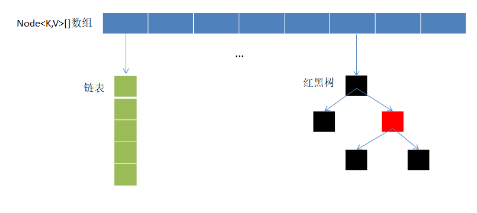

# HashMap

`HashMap` ——哈希图，哈希图基于哈希表（即数组 + 链表 + 红黑树）实现，其核心特性就是存储键值对 （Key-Value）。



本节学习内容：

1. 了解 `HashMap` 源码的大致框架结构。

## 源码

```java
public class HashMap<K,V> extends AbstractMap<K,V>
        implements Map<K,V>, Cloneable, Serializable {

    // 序列化版本号
    private static final long serialVersionUID = 362498820763181265L;

    // 默认初始容量（16，必须是 2 的幂次）
    static final int DEFAULT_INITIAL_CAPACITY = 1 << 4; // 等价于 16

    // 最大容量（2^30）	1073741824
    static final int MAXIMUM_CAPACITY = 1 << 30;

    // 默认负载因子
    static final float DEFAULT_LOAD_FACTOR = 0.75f;

    // 链表转红黑树的阈值
    static final int TREEIFY_THRESHOLD = 8;

    // 红黑树转链表的阈值
    static final int UNTREEIFY_THRESHOLD = 6;

    // 链表转红黑树的最小数组容量
    static final int MIN_TREEIFY_CAPACITY = 64;

    // 哈希表的底层数组（存储链表/红黑树的头节点，长度始终是 2 的幂次）
    transient Node<K,V>[] table;

    // 存储所有键值对的 Set 视图（用于遍历）
    transient Set<Map.Entry<K,V>> entrySet;

    // 哈希表中元素的数量
    transient int size;

    // 哈希表结构修改次数（用于快速失败机制，检测并发修改）
    transient int modCount;

    // 扩容阈值（size 达到该值时触发扩容）
    int threshold;

    // 负载因子
    final float loadFactor;

    // 内部类：哈希表的节点（链表节点）
    static class Node<K,V> implements Map.Entry<K,V> {
        final int hash; // 节点的哈希值（基于 key 的 hashCode 计算）
        final K key;    // 键（不可修改）
        V value;        // 值
        Node<K,V> next; // 下一个链表节点
        
        // 联表节点相关方法，省略...
    }

    // 内部类：红黑树节点（继承自 LinkedHashMap.Entry，省略具体实现）
    static final class TreeNode<K,V> extends LinkedHashMap.Entry<K,V> {
        TreeNode<K,V> parent; // 父节点
        TreeNode<K,V> left;   // 左子节点
        TreeNode<K,V> right;  // 右子节点
        TreeNode<K,V> prev;   // 前一个节点（用于双向链表）
        boolean red;          // 节点颜色（红/黑）
        TreeNode(int hash, K key, V val, Node<K,V> next) {
            super(hash, key, val, next);
        }
        // 红黑树相关方法，省略...
    }

    // 构造方法：指定初始容量和负载因子
    public HashMap(int initialCapacity, float loadFactor) {
        if (initialCapacity < 0)
            throw new IllegalArgumentException("Illegal initial capacity: " + initialCapacity);
        if (initialCapacity > MAXIMUM_CAPACITY)
            initialCapacity = MAXIMUM_CAPACITY;
        if (loadFactor <= 0 || Float.isNaN(loadFactor))
            throw new IllegalArgumentException("Illegal load factor: " + loadFactor);
        this.loadFactor = loadFactor;
        // 计算初始扩容阈值（后续 resize 时会调整为 2 的幂次容量）
        this.threshold = tableSizeFor(initialCapacity);
    }

    // 构造方法：指定初始容量（使用默认负载因子 0.75）
    public HashMap(int initialCapacity) {
        this(initialCapacity, DEFAULT_LOAD_FACTOR);
    }

    // 构造方法：默认构造（初始容量 16，负载因子 0.75）
    public HashMap() {
        this.loadFactor = DEFAULT_LOAD_FACTOR; // 阈值默认在 resize 时初始化
    }

    // 构造方法：传入另一个 Map
    public HashMap(Map<? extends K, ? extends V> m) {
        this.loadFactor = DEFAULT_LOAD_FACTOR;
        putMapEntries(m, false);
    }
}
```

