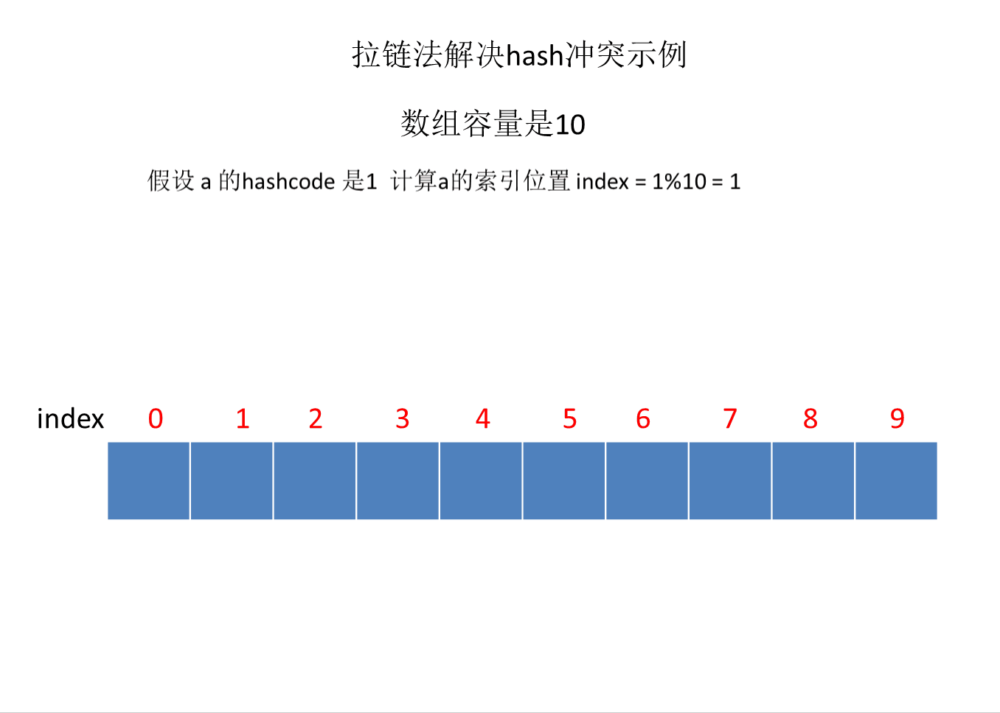

# HashMap

本文的内容从 `Node` 又回到 `HashMap` ，在 *04_HashMap03* 中了解到了 `Node` 作为 `HashMap` 的存储元素的单个节点，在本文中，开发者将会学习到 `HashMap` 是如何管理 `Node` 。

`HashMap` 对于 `Node` 节点管理的方法很值得开发者学习，比如：哈希寻址、联表与红黑树的转化、扩容机制。

也许在大部分的实际业务中很少会使用到这些方法，但总有一瞬间开发者会获得灵感，使得枯燥无味的业务流程变得更加有趣味。

## 添加 Node 节点——putVal()

```java
/**
 * Map.put() 底层核心实现方法，新增/覆盖键值对统一入口
 * @param hash 键经过扰动函数计算后的哈希值
 * @param key 待插入的键
 * @param value 待插入的值
 * @param onlyIfAbsent true：仅key不存在时才赋值，不覆盖已有值；false：允许覆盖原有值
 * @param evict 驱逐标记，仅 LinkedHashMap 生效
 *             true：普通新增场景，可淘汰长期未访问元素（LRU）
 *             false：构造初始化批量导入场景，禁止淘汰元素
 */
final V putVal(int hash, K key, V value, boolean onlyIfAbsent, boolean evict) {
    Node<K,V>[] tab;    // 临时引用哈希底层数组table
    Node<K,V> p;        // 桶下标位置的首节点
    int n;              // 哈希数组长度
    int i;              // 当前key对应的数组桶下标

    // 数组未初始化 / 长度为0，调用resize完成初始化
    if ((tab = table) == null || (n = tab.length) == 0)
        n = (tab = resize()).length;

    // 计算桶下标，该下标无节点，直接新建节点放入桶中
    if ((p = tab[i = (n - 1) & hash]) == null)
        tab[i] = newNode(hash, key, value, null);
    // 桶下标已存在节点，处理哈希冲突
    else {
        Node<K,V> e; // 用于存储匹配到key的目标节点
        K k;

        // 桶首节点与待插入key完全相同（hash一致 && key地址相等/equals相等）
        if (p.hash == hash && ((k = p.key) == key || (key != null && key.equals(k))))
            e = p;
        // 桶首节点是红黑树节点，走树节点插入逻辑
        else if (p instanceof TreeNode)
            e = ((TreeNode<K,V>)p).putTreeVal(this, tab, hash, key, value);
        // 桶为链表结构，向后遍历链表
        else {
            for (int binCount = 0; ; ++binCount) {
                // 遍历到链表尾部，尾部插入新节点
                if ((e = p.next) == null) {
                    p.next = newNode(hash, key, value, null);
                    // 链表长度达到树化阈值，将链表转为红黑树
                    if (binCount >= TREEIFY_THRESHOLD - 1)
                        treeifyBin(tab, hash);
                    break;
                }
                // 链表中找到相同key的节点，终止遍历
                if (e.hash == hash && ((k = e.key) == key || (key != null && key.equals(k))))
                    break;
                // 指针后移，继续对比下一个链表节点
                p = e;
            }
        }

        // 链表/红黑树中找到存在的key，执行值覆盖逻辑
        if (e != null) {
            V oldValue = e.value;
            // 允许覆盖 或 旧值为null，更新value
            if (!onlyIfAbsent || oldValue == null)
                e.value = value;
            // 后置回调，LinkedHashMap重写维护访问顺序
            afterNodeAccess(e);
            // 返回被覆盖的旧值
            return oldValue;
        }
    }

    // 新增元素，修改计数自增（用于快速失败fail-fast）
    ++modCount;
    // 元素总数自增后超过扩容阈值，触发扩容
    if (++size > threshold)
        resize();
    // 插入后置回调，LinkedHashMap重写实现LRU淘汰逻辑
    afterNodeInsertion(evict);
    // 本次为全新插入，无旧值返回null
    return null;
}
```

`putVal()` 展示了 `HashMap` 存储结构的全貌，关于 `putVal()` 的流程图开发者可以自行搜索或绘制。

### 哈希寻址

```java
if ((p = tab[i = (n - 1) & hash]) == null) 
    tab[i] = newNode(hash, key, value, null);
```



`tab[i = (n - 1) & hash]` 会计算出元素在 `table` 数组的哪一索引位置下，`if ((p = tab[i = (n - 1) & hash]) == null) ` 该索引下的位置如果为 null（即该位置没有元素）则会将元素放置该位置，如上图所示。

如果该位置下有元素，如果该索引下是链表则会进行尾插，如果是红黑树则会交给红黑树的插入方法处理。

## 批量添加 Map 集合元素——putMapEntries()

```java
/**
 * 批量导入外部Map全部键值对，由HashMap带参构造方法 HashMap(Map<? extends K, ? extends V> m) 调用
 * @param m 待导入的源映射集合
 * @param evict 元素驱逐标记，仅LinkedHashMap生效
 *             true：普通新增、扩容场景，允许淘汰旧访问元素
 *             false：构造初始化导入场景，本方法调用时固定传入，禁止淘汰元素
 * 示例推演条件：默认初始容量16、负载因子0.75，源集合元素数量s=10
 */
final void putMapEntries(Map<? extends K, ? extends V> m, boolean evict) {
    // 获取源集合元素总数，示例 s = 10
    int s = m.size();
    // 源集合非空才执行批量导入逻辑
    if (s > 0) {
        // 判断底层哈希数组table是否初始化：HashMap实例创建后table默认null，延迟初始化
        if (table == null) {
            // 预计算容纳全部元素所需理论容量，避免循环插入时频繁扩容
            // 计算公式：元素数量 / 负载因子，示例 10 / 0.75 = 13.33333
            /*
             * 计算逻辑说明：负载因子0.75代表元素达到容量75%时触发扩容
             * 已知元素数量反推所需总容量 = 当前元素数 / 负载因子
             * 后续仅限制容量不超过HashMap全局最大容量上限即可
             */
            // 额外+1.0F：强转int会向下取整，预留空间防止容量计算不足；示例 ft = 14.33333
            float ft = ((float)s / loadFactor) + 1.0F;
            // 限制容量不超过MAXIMUM_CAPACITY，浮点转整型舍去小数，示例 t = 14
            int t = ((ft < (float)MAXIMUM_CAPACITY) ?
                     (int)ft : MAXIMUM_CAPACITY);
            // 若预估所需容量大于现有扩容阈值，更新阈值为大于t的最小2次幂
            // 阈值规则：threshold = 数组容量 * 负载因子；原阈值 16 * 0.75 = 12
            // 示例 t=14 > 12，需重新计算阈值
            if (t > threshold)
                // tableSizeFor(14) 返回最近2次幂16，赋值给阈值
                threshold = tableSizeFor(t);
        }
        // 底层哈希数组table已完成初始化
        else {
            // 源集合元素总数超过扩容阈值，且数组未达最大容量，循环扩容
            // 提前扩容一次性分配足够空间，防止逐个插入时多次扩容损耗性能
            while (s > threshold && table.length < MAXIMUM_CAPACITY)
                // table初始化、数组扩容、阈值更新逻辑统一封装在resize()方法
                resize();
        }

        // 遍历源集合，逐个插入键值对
        for (Map.Entry<? extends K, ? extends V> e : m.entrySet()) {
            K key = e.getKey();
            V value = e.getValue();
            putVal(hash(key), key, value, false, evict);
        }
    }
}
```

##  table 初始化及扩容方法——resize()

```java
/**
 * 批量将传入Map的所有键值对存入当前HashMap，由HashMap(Map<? extends K, ? extends V>)构造方法调用
 * @param m 待导入的源映射集合
 * @param evict 淘汰标记，仅对LinkedHashMap生效
 *        true：常规新增/扩容场景，允许淘汰旧元素
 *        false：构造初始化导入场景，禁止淘汰元素（本方法调用时固定传false）
 * 示例说明：默认初始容量16、负载因子0.75，待导入集合元素数量s=10
 */
final void putMapEntries(Map<? extends K, ? extends V> m, boolean evict) {
    // 获取源集合元素总数，示例 s = 10
    int s = m.size();
    // 源集合非空才执行导入逻辑
    if (s > 0) {
        // 底层数组table未初始化（new HashMap后table默认null，首次进行添加操作才会初始化）
        if (table == null) {
            // 计算容纳全部元素所需理论容量，避免插入时频繁扩容
            // 公式：元素数量 / 负载因子，示例 10 / 0.75 = 13.3333
            float ft = ((float)s / loadFactor) + 1.0F;
            // 限制容量不超过HashMap最大上限，浮点转整型截断小数，示例 t = 14
            int t = ((ft < (float)MAXIMUM_CAPACITY) ?
                    (int)ft : MAXIMUM_CAPACITY);
            // 若计算出的所需容量大于当前扩容阈值，重新计算阈值为大于t的最小2次幂
            // 示例原阈值threshold=16*0.75=12，t=14>12，执行tableSizeFor(14)得到16赋值给threshold
            if (t > threshold)
                threshold = tableSizeFor(t);
        }
        // 底层数组table已完成初始化
        else {
            // 源集合元素总数超过扩容阈值，且数组长度未达上限，则循环扩容
            // 提前扩容至足够容量，防止遍历插入时多次触发扩容损耗性能
            while (s > threshold && table.length < MAXIMUM_CAPACITY)
                // 数组初始化、阈值更新、扩容逻辑均在resize()方法实现
                resize();
        }

        // 遍历源集合，逐个插入键值对
        for (Map.Entry<? extends K, ? extends V> e : m.entrySet()) {
            K key = e.getKey();
            V value = e.getValue();
            // hash计算key哈希，第四个参数false代表不允许覆盖已有key
            putVal(hash(key), key, value, false, evict);
        }
    }
}
```

## 删除 Node 节点——removeNode()

```java
/**
 * 根据哈希值、键、值删除指定节点，HashMap 底层删除核心方法
 * @param hash 待删除键的哈希值
 * @param key 待删除的键对象
 * @param value 待匹配的值对象
 * @param matchValue 是否需要匹配值：true 要求键和值同时匹配才删除；false 仅匹配键即可删除
 * @param movable 红黑树删除时是否允许移动根节点，用于迭代器遍历场景防止树结构变动导致遍历异常
 * @return 被删除的节点；若未找到匹配节点、值不匹配则返回 null
 */
final Node<K,V> removeNode(int hash, Object key, Object value,
                           boolean matchValue, boolean movable) {
    // 哈希表数组、当前桶头节点、数组长度、目标桶下标
    Node<K,V>[] tab; Node<K,V> p; int n, index;
    // 校验哈希表非空、数组长度大于0、目标桶存在头节点
    if ((tab = table) != null && (n = tab.length) > 0 &&
        (p = tab[index = (n - 1) & hash]) != null) {
        // node：最终匹配到待删除的节点；e：遍历临时节点；k：临时键；v：临时值
        Node<K,V> node = null, e; K k; V v;

        // 情况1：桶头节点就是目标节点，直接赋值给node
        if (p.hash == hash &&
            ((k = p.key) == key || (key != null && key.equals(k))))
            node = p;
        // 情况2：桶下存在后续链表/树节点，继续向后查找
        else if ((e = p.next) != null) {
            // 桶结构为红黑树，调用树节点查询方法获取目标节点
            if (p instanceof TreeNode)
                node = ((TreeNode<K,V>)p).getTreeNode(hash, key);
            // 桶结构为普通单向链表，循环遍历链表寻找目标节点
            else {
                do {
                    // 哈希相等 + 键地址相等 / equals相等，匹配成功
                    if (e.hash == hash &&
                        ((k = e.key) == key ||
                         (key != null && key.equals(k)))) {
                        node = e;
                        break;
                    }
                    // 记录当前遍历节点，作为待删节点的前驱节点
                    p = e;
                } while ((e = e.next) != null);
            }
        }

        // 找到目标节点，且值匹配规则校验通过才执行删除
        // !matchValue：不需要匹配值；matchValue=true时，值地址相等或equals相等才算匹配
        if (node != null && (!matchValue || (v = node.value) == value ||
                             (value != null && value.equals(v)))) {
            // 分支1：当前节点是红黑树节点，执行红黑树删除逻辑
            if (node instanceof TreeNode)
                ((TreeNode<K,V>)node).removeTreeNode(this, tab, movable);
            // 分支2：待删节点是桶头节点，直接将桶下标指向当前节点下一个元素
            else if (node == p)
                tab[index] = node.next;
            // 分支3：待删节点是链表中间/尾部节点，修改前驱节点next指针跳过当前节点
            else
                p.next = node.next;

            // 修改计数器，并发修改检测（迭代器快速失败）
            ++modCount;
            // 集合元素数量减一
            --size;
            // 节点删除后的后置回调方法，LinkedHashMap重写用于维护访问顺序
            afterNodeRemoval(node);
            // 返回已删除节点
            return node;
        }
    }
    // 哈希表为空 / 目标桶无元素 / 未匹配到节点 / 值不匹配，返回null
    return null;
}
```

## 获取指定 Node 节点——getNode()

```java
/**
 * get() 底层核心方法，根据 key 查找对应节点
 * @param key 待查询的键对象
 * @return 匹配 key 的节点，无匹配则返回 null
 */
final Node<K,V> getNode(Object key) {
    Node<K,V>[] tab;    // 临时引用哈希底层数组 table
    Node<K,V> first, e; // first：目标桶的头节点；e：遍历链表时临时后继节点
    int n;              // 哈希数组长度
    int hash;           // key 经过扰动函数计算后的哈希值
    K k;                // 缓存节点内部 key，用于等值判断

    // 校验数组已初始化且长度大于0，同时定位key对应的桶头节点
    /*
     * 索引计算逻辑：(n - 1) & hash(key)
     * 等价于 hash % n，利用二进制与运算提升取模效率，取值范围固定 0 ~ n-1
     * 示例推演条件：初始容量16，数组长度n=16，n-1=15；key="Java"
     * 1. 原始 hashCode("Java") = 2301506
     * 2. 扰动哈希 hash = hashCode ^ (hashCode >>> 16) = 2301537
     * 3. (15 & 2301537) 计算得到目标桶下标为1
     * 4. first = tab[1]，即取下标1位置的头节点
     */
    if ((tab = table) != null && (n = tab.length) > 0 &&
        (first = tab[(n - 1) & (hash = hash(key))]) != null) {
        // 桶头节点的hash与key完全匹配，直接返回头节点
        if (first.hash == hash &&
            ((k = first.key) == key || (key != null && key.equals(k))))
            return first;

        // 桶存在后继节点，区分红黑树/链表两种结构遍历查找
        if ((e = first.next) != null) {
            // 当前桶为红黑树结构，调用树节点查询方法
            if (first instanceof TreeNode)
                return ((TreeNode<K,V>)first).getTreeNode(hash, key);
            // 当前桶为单向链表，循环遍历匹配key
            do {
                if (e.hash == hash &&
                    ((k = e.key) == key || (key != null && key.equals(k))))
                    return e;
            } while ((e = e.next) != null);
        }
    }
    // 四种场景返回null：
    // 1. 哈希数组未初始化  2. 数组长度为0
    // 3. 目标桶无任何节点  4. 链表/红黑树遍历完毕未匹配到key
    return null;
}
```

## 链表树化前置方法——treeifyBin()

```java
/**
 * 链表树化预处理：满足容量条件时将数组指定下标下的单向 Node 链表转为 TreeNode 双向链表，再执行红黑树构建；容量不足则扩容
 * @param tab HashMap 底层哈希数组 table
 * @param hash 待处理 key 的哈希值，用于计算数组下标
 *
 * 前置调用前提（本方法不做判断，由外层 putVal() 控制）：哈希槽链表长度达到树化阈值8，才会调用本方法
 * 核心分支逻辑：
 * 1. 若哈希数组未初始化 / 数组容量小于最小树化容量64：执行扩容 resize()，放弃本次树化
 * 2. 数组已初始化且容量达标：取出当前下标单向 Node 链表，遍历转换为 TreeNode 双向链表，再调用 treeify 构建红黑树
 * 补充说明：
 * MIN_TREEIFY_CAPACITY = 64，是开启链表树化的最低数组容量阈值；
 * 仅链表过长但数组容量不足时，优先扩容而非树化，减少红黑树维护开销；
 * TreeNode 双向链表仅为中间过渡结构，最终会被转化为符合红黑树约束的树形结构。
 */
final void treeifyBin(Node<K,V>[] tab, int hash) {
    // 哈希数组长度
    int n;
    // 目标哈希槽下标
    int index;
    // 当前遍历的普通单向链表节点
    Node<K,V> e;
    // 分支1：数组未初始化 或 数组容量未达到最小树化阈值 64，执行扩容，不进行树化处理
    if (tab == null || (n = tab.length) < MIN_TREEIFY_CAPACITY)
        resize();
    // 分支2：数组初始化完成且容量满足树化要求，取出目标下标链表头节点
    else if ((e = tab[index = (n - 1) & hash]) != null) {
        // TreeNode 双向链表头节点
        TreeNode<K,V> hd = null;
        // TreeNode 双向链表尾节点
        TreeNode<K,V> tl = null;
        // 遍历原单向 Node 链表，逐个转换为 TreeNode，构建双向链表
        do {
            // 将普通 Node 节点转为 TreeNode 节点，复制原有 hash、key、value 属性
            TreeNode<K,V> p = replacementTreeNode(e, null);
            if (tl == null)
                // 双向链表为空，初始化头节点
                hd = p;
            else {
                // 尾插构建双向关联：新节点前置指向原尾节点，原尾节点后置指向新节点
                p.prev = tl;
                tl.next = p;
            }
            // 更新尾指针，指向当前新增的 TreeNode
            tl = p;
        } while ((e = e.next) != null);

        // 将转换完成的 TreeNode 双向链表放回哈希数组对应下标
        if ((tab[index] = hd) != null)
            // 基于双向 TreeNode 链表，正式构建红黑树
            hd.treeify(tab);
    }
}
```

