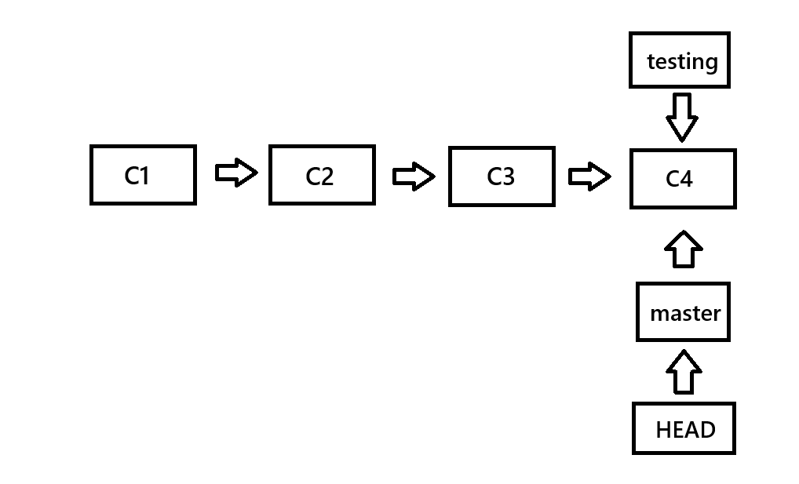
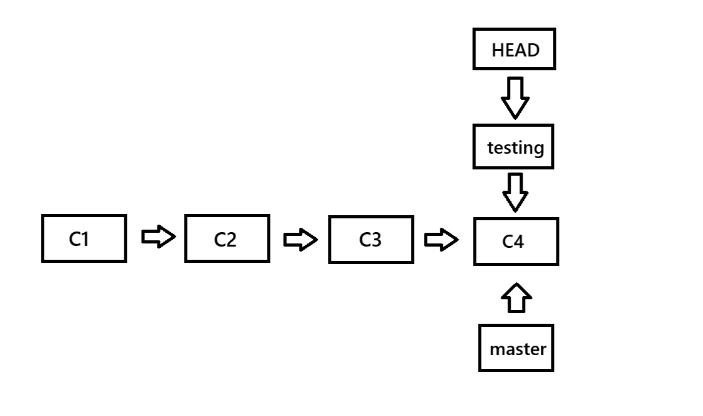
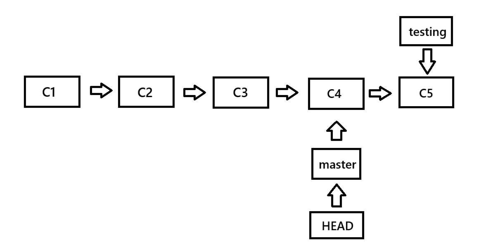
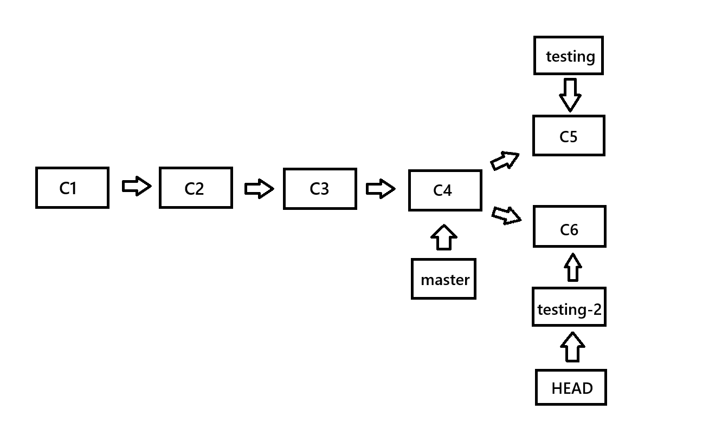

# Git 分支

Git 是一个版本控制器，开发者在开发时是会按阶段开发，每一个阶段开发者会需要记录一次。

但是在开发一个系统的时候，开发者可能并不会按照事先规定好的路线进行开发，在某一阶段开发结束后，**开发者想要尝试另一线路进行开发——那么这里称这条线路为分支，原先线路则称为主分支**。

分支的简介这里不再介绍，开发者可自行观看 Git 的官方文档。

## 分支创建

`git branch testing` ，该命令会执行并创建一个名为 `testing` 的分支。

此时 Git Bash 会显示如下：

```bash
# 创建分支
git branch testing

# 查看分支
git branch
* master
  testing
```

`*` 表示 HEAD 指针，HEAD 指针此时指向 master 分支。

## 分支切换

`git checkout testing`，切换分支。

```bash
# 切换分支
git checkout testing

# 查看分支
git branch
  master
* testing
```

## 完整流程

初始化仓库后，会有默认的主分支 `master` （主分支名称由开发者安装 Git 时定义）。

此时，开发者想要创建一个新的分支执行了 `git branch testing`

```bash
# 创建分支
git branch testing
```

此时 `.git` 文件中的结构信息如下图所示：



此时，名为 `master` 的指针和 `testing` 指针指向了名为 `C4` 的提交记录。HEAD 指针（即当前指针）指向 `master` 分支。

此时开发者执行了 `git checkout testing` ，切换了分支，此时 `HEAD` 指针会指向 `testing` 。如下图所示：




开发者准备在 `testing` 分支上进行新的功能开发，当开发者开发到一定程度时，执行了 `git commit` ，此时 `testing` 会领先 `master` 分支一次提交。如下图所示：



开发者在 `testing` 分支进行开发时，发现方向错误或者说需要调整方向，那么开发者会执行 `git checkout master` ，执行后 Git 回将暂存区、工作区、HEAD 指针回退至 `master` 分支。

回退后，一定要保证 `master` 分支不能改变（因为该分支大概率已经经过了开发、测试，甚至上线），开发者额外创建一个分支 `git branch testing-2`。

此时开发者仍需要 `git checkout testing-2` 切换至新的分支，并进行新的开发，`git commit` 提交记录。如下图所示：



