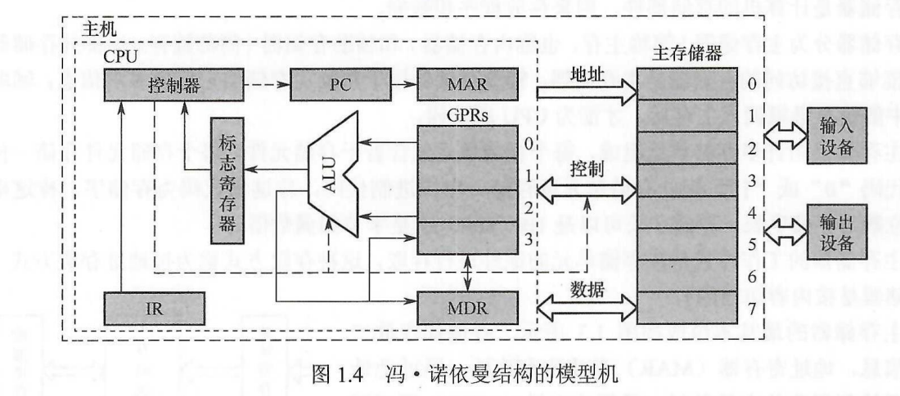
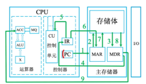

# 计算机组成
## 计算机的指令执行流程

在学习计算机指令执行流程之前，可先参考两张示意图辅助理解：
- 冯·诺依曼结构模型机

- 计算机指令执行流程图

CPU执行一条指令的完整过程分为**取指阶段**和**译码执行阶段**，两个阶段循环往复，完成程序的全部指令执行。

### 取指阶段：获取待执行指令
取指阶段的核心目标是从主存中取出下一条待执行的指令，送入CPU的指令寄存器，该过程由PC、MAR、MDR、IR协同完成，步骤如下：
1. PC中保存着下一条指令的内存地址，将该地址送入MAR；
2. MAR将地址通过地址总线发送给主存；
3. 主存根据收到的地址，读出对应位置的二进制指令，传送至MDR；
4. MDR将接收到的指令传送至IR，由IR暂存当前待执行的指令；
5. PC自动自增，更新为下一条指令的内存地址，为下一轮取指操作做准备。

### 译码执行阶段：完成指令功能
取指完成后进入执行阶段，由控制器主导完成指令解析与功能执行：
1. CU（控制单元）解析IR中存储的指令，识别指令类型与操作要求；
2. CU根据指令含义，向运算器、存储器、IO设备等对应部件发出控制信号；
3. 各部件接收控制信号后，完成对应的操作（如算术运算、内存读写、数据输出等）；
4. 若指令需要再次访问内存读写数据，会复用MAR与MDR完成数据传输，最终完成整条指令的执行
