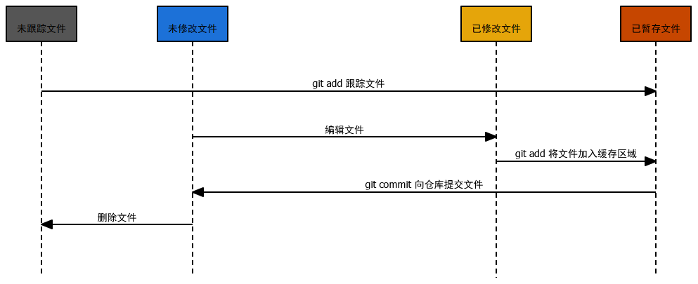

# Git 基础

在日常的开发过程中尝试用的 Git 基本命令，都会在本文讲述。

## 建立 Git 仓库

`git init`，`git init` 会在指定的文件下初始一个 Git 仓库，以 .git 文件夹的形式存在，.git 文件夹就是开发者的本地仓库。

`git init` 只会建立一个空仓库，此时该仓库中是没有任何文件存在的，需要开发者使用其他命令向本地仓库中添加文件。

在 Git Bash 中使用命令建立仓库时，开发者要先进入指定目录文件下，假设开发者要对 `D:/projects/xxx` 建立一个 Git 仓库，在 Git Bash 中依次输入以下命令。

```bash
# 进入 d 磁盘
cd d:

# 查看该磁盘下的所有文件夹信息
ls

# 确定指定文件夹存在后，进入指定文件夹
cd projects/xxx

# 建立 Git 仓库
git init
```

建立仓库后，在 Git Bash 中，会有提示（在文件路径的末尾会有 master 字样，该字样为开发者安装 Git Bash 时所设置的字样，至于是哪一步设置的请开发者自行搜寻修相关信息）如下：

```bash
/d/projects/Web_projects/zgssd/code_resource/java-resource (master)
```

## 克隆仓库

开发者除了使用 `git init` 建立一个新仓库，开发者也可以克隆他人服务器上的仓库，从而达到在本地建立一个仓库的目的。

`git clone <url>` ，该命令会克隆他人服务器上的 Git 仓库。

假设开发者要克隆 github 上某个项目，项目地址为 `https://github.com/xxx/xxx` ，开发者可以在 Git Bash 中输入以下命令：

```bash
git clone https://github.com/xxx/xxx
```

`git clone <url>` 不仅支持 Http 协议，如：SSH 传输协议后者 git:// 传输协议等等。这使得开发者也可以在自己的服务器上配置 Git 。

## Git 工作流程

在正式往 Git 仓库添加文件时，先讲述一下 Git 是如何管理项目文件的，Git 会跟踪工作区的所有文件，并对这些文件进行标记，Git Bash 中查看这些文件时，文件会呈现不同的颜色。

Git 将文件分为四种状态： 

- 未跟踪文件 
- 修改文件 
- 已修改文件
- 已暂存文件

文件的状态的时许变化图如下：



`git init` 开发者之前已经学习过了，这里不再讲述。

#### 跟踪文件

`git add <file>` ，使用该命令 Git 会跟踪指定文件，此时 Git 会持续监听文件的变化，但是 Git 仓库中此时并没有该文件。

#### 获取文件状态

`git status` ，改命令会详细展现 `git add` 所跟踪的所有文件信息，如下：

```bash
$ git status

On branch master

No commits yet

Changes to be committed:
  (use "git rm --cached <file>..." to unstage)
        new file:   xxx/Test.java

Untracked files:
  (use "git add <file>..." to include in what will be committed)
        .editorconfig
        .gitignore
        pom.xml
		...
```

on branch master 表示在主分支下。

No commits yet 表示没有一次提交记录。

Changes to be committed 表示已经暂存的文件，已暂存只有一个名为 `Test.java` 的文件。

Untracked files 表示暂未追踪的文件。

#### 取消文件的跟踪状态

在 Changes to be committed 后有一段 `(use "git rm --cached <file>..." to unstage)` 表示开发者可以使用 `git reset --cached <file>` 取消文件的跟踪状态。

```bash
$ git rm --cached xxx/Test.java

On branch master

No commits yet

Untracked files:
  (use "git add <file>..." to include in what will be committed)
        .editorconfig
        .gitignore
        pom.xml
        ...

nothing added to commit but untracked files present (use "git add" to track)
```

此时使用 `git status` Git 会提示开发者没有跟踪任何文件，请使用 `git add` 跟踪文件。

#### 提交文件至本地仓库

`git commite` ，使用该命令 Git 会将所跟踪的文件提交至本地仓库（注意是本地仓库，不是远程仓库，关于本地仓库和远程仓库的协作流程会在后续讲述）。

#### 跳过暂存区直接提交至本地仓库

`git commite -a` ，在前面的学习中，开发者知道如果想要将文件提交至本地仓库中，那么开发者必须先使用 `git add` 将文件提交至暂存区，然后使用 `git commite` 提交至本地仓库。但是开发者可以使用 `git commite -a` 跳过 `git add` 这一步（看似跳过实则没有跳过，只是简化了命令）。

在使用 `git commit -a` 这一命令时，开发者要注意，`git commite -a` 只会提交**所有已跟踪的文件**，在这些已跟踪的文件中，有些开发者并不想提交，那么请慎用 `git commite -a` 。

#### 移除文件

`git rm <fileName>` ，Git 不建议开发者使用该命令，该命令会删除本地文件 + 从暂存区移除，且该命令使用前提为：**如果文件本地有修改（和暂存区不一样），直接 `git rm` 会报错，不让删。**但是该命令并不会直接删除本地仓库中的文件，只有当开发者再次使用 `git commite` 提交操作时，文件会从本地仓库中删除。

`git rm -f` ，该命令是 `git rm <fileName>` 的强制版，该命令不会有使用前提（慎用）。

`git rm --cached` ，该命令只会将文件从暂存区移除，本地文件是不用有任何改动。

#### 查看提交历史

Git 记录开发者每一次提交的记录。当开发者从远程仓库克隆项目后，该项目会记录每一位提交人的信息以及相关操作。

开发者如果想要查看这些信息可以使用 `git log` 查看日志信息。`git log` 会按照提交日期的新旧从高到低罗列出来，具体信息如下：

```bash
git log

commit ca82a6dff817ec66f44342007202690a93763949
Author: Scott Chacon <schacon@gee-mail.com>
Date:   Mon Mar 17 21:52:11 2008 -0700
    changed the version number
commit 085bb3bcb608e1e8451d4b2432f8ecbe6306e7e7
Author: Scott Chacon <schacon@gee-mail.com>
Date:   Sat Mar 15 16:40:33 2008 -0700
    removed unnecessary test
commit a11bef06a3f659402fe7563abf99ad00de2209e6
Author: Scott Chacon <schacon@gee-mail.com>
Date:   Sat Mar 15 10:31:28 2008 -0700
```

从以上信息开发者可以看到：
`commit ca82a6dff817ec66f44342007202690a93763949` ——SHA-1校验和；

`Author: Scott Chacon <schacon@gee-mail.com>` ——提交人的 Git 所配置的 username 和 mail；

`Data：Mon Mar 17 21:52:11 2008 -0700` ——提交日期；

`changed the version number` ——提交说明。

#### 查看提交历史文件的差异变化

`git log -p` / `git log -patch` ，该命令是最有用的命令，开发者可以查看提交历史中文件的差异变化，假设开发者想要查看最近两次提交的记录，可以命令末尾加 `-2`，具体信息如下：

```bash
git log -p -2

commit ca82a6dff817ec66f44342007202690a93763949
Author: Scott Chacon <schacon@gee-mail.com>
Date:   Mon Mar 17 21:52:11 2008 -0700
    changed the version number
diff --git a/Rakefile b/Rakefile
index a874b73..8f94139 100644--- a/Rakefile
+++ b/Rakefile
@@ -5,7 +5,7 @@ require 'rake/gempackagetask'
 spec = Gem::Specification.new do |s|
     s.platform  =   Gem::Platform::RUBY
     s.name      =   "simplegit"-    s.version   =   "0.1.0"
+    s.version   =   "0.1.1"
     s.author    =   "Scott Chacon"
     s.email     =   "schacon@gee-mail.com"
     s.summary   =   "A simple gem for using Git in Ruby code."
```

分段拆解：

```bash
commit ca82a6dff817ec66f44342007202690a93763949
Author: Scott Chacon <schacon@gee-mail.com>
Date:   Mon Mar 17 21:52:11 2008 -0700
    changed the version number
```

以上信息不在讲述，其信息内容和 `git log` 的信息一样。

```bash
diff --git a/Rakefile b/Rakefile
index a874b73..8f94139 100644
--- a/Rakefile
+++ b/Rakefile
@@ -5,7 +5,7 @@ require 'rake/gempackagetask'
 spec = Gem::Specification.new do |s|
     s.platform  =   Gem::Platform::RUBY
     s.name      =   "simplegit"-    s.version   =   "0.1.0"
+    s.version   =   "0.1.1"
     s.author    =   "Scott Chacon"
     s.email     =   "schacon@gee-mail.com"
     s.summary   =   "A simple gem for using Git in Ruby code."
```

`diff --git a/Rakefile b/Rakefile` ——文件 `Rakefile` 的 diff 信息（差异块信息），前缀 a 表示旧文件，后缀 b 表示新文件。第一次提交旧文件不存在会出现 `/dev/null` 的提示

`index a874b73..8f94139 100644` ——从 `index` 分割，只看后面的信息 。`a874b73` ——旧文件内容的 blob 哈希（开发者可以理解为根据文件内容生成的哈希字符串）；`..` ——分隔符；`8f94139` ——新文件内容 blob 哈希。

`--- a/Rakefile +++ b/Rakefile`，`--- a/Rakefile` ——旧文件，`+++ b/Rakefile` 新增的文件。

`@@ -5,7 +5,7 @@ require 'rake/gempackagetask'` ，这一行只需要看 `@@ -5,7 +5,7 @@` ——表示修改代码的行数，如果是 ``@@ -5,7 +5,5 @@` ——表示代码行数少了两行；`require 'rake/gempackagetask'` ——字面意思，看不懂查英文意思（不重要）。

最后的部分就是修改代码的信息与痕迹了。
